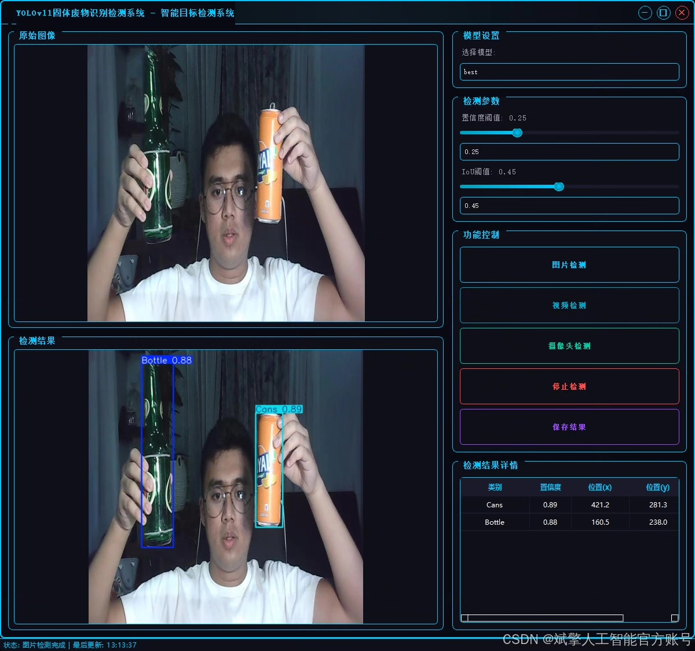
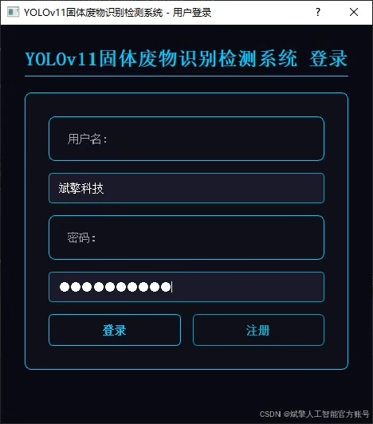
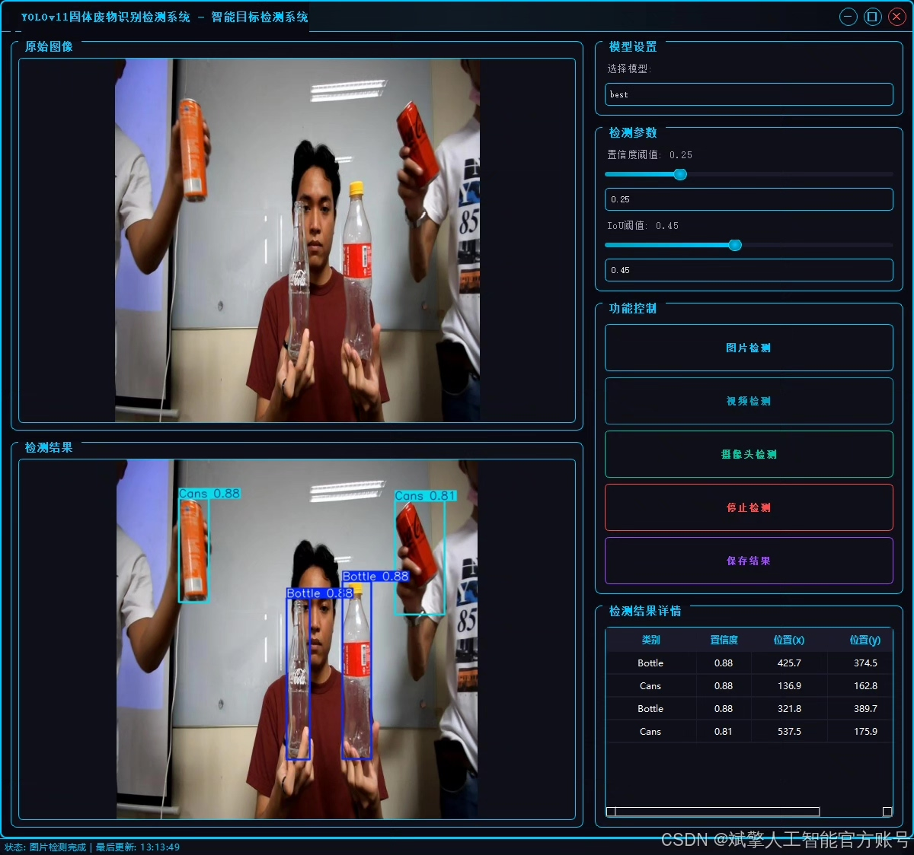
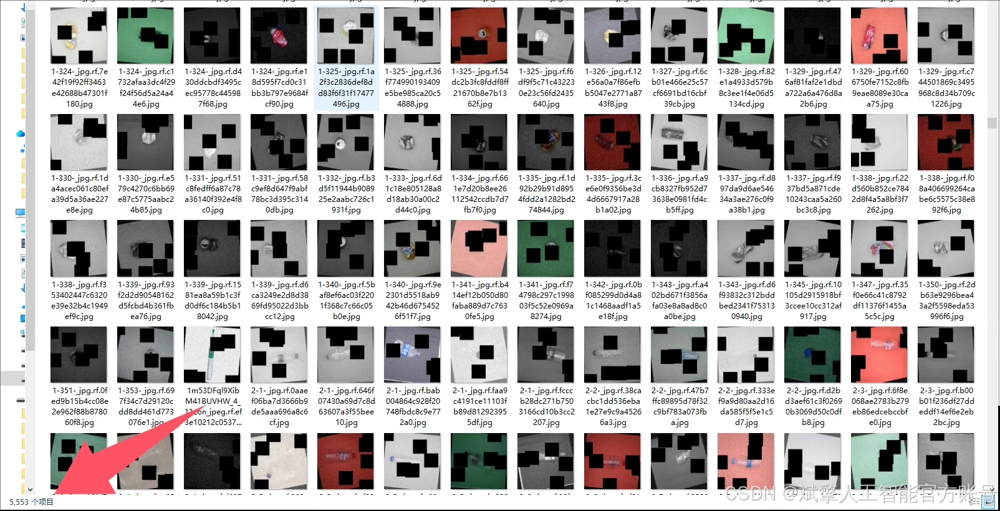
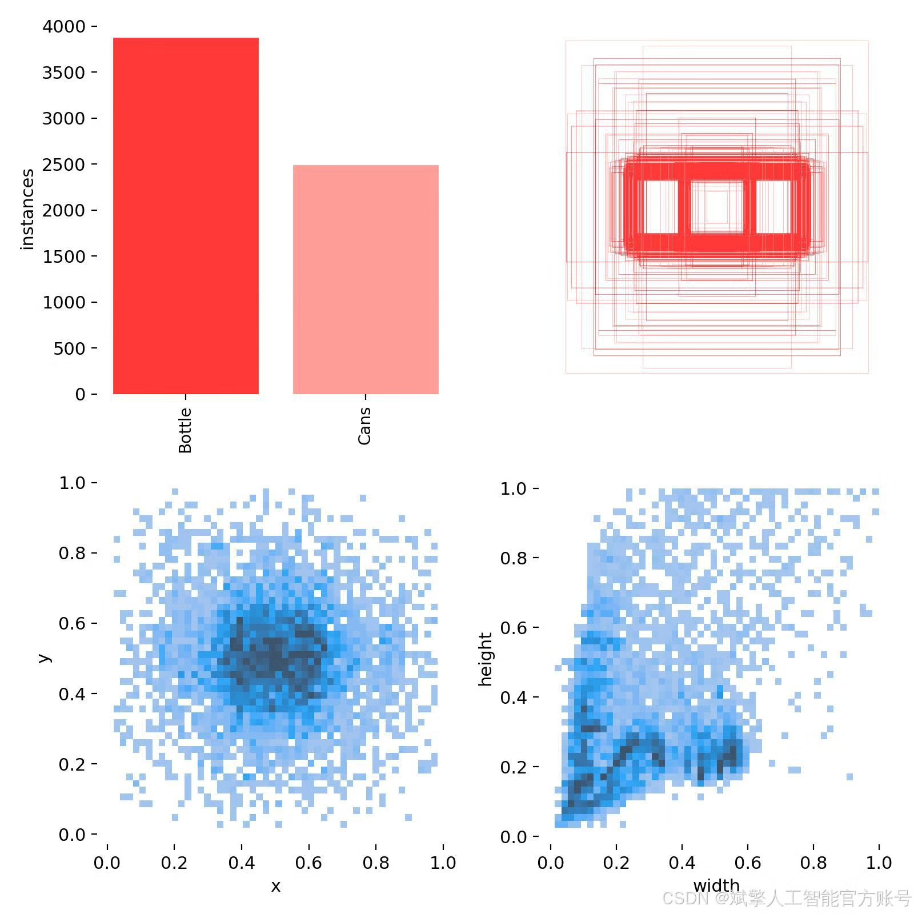
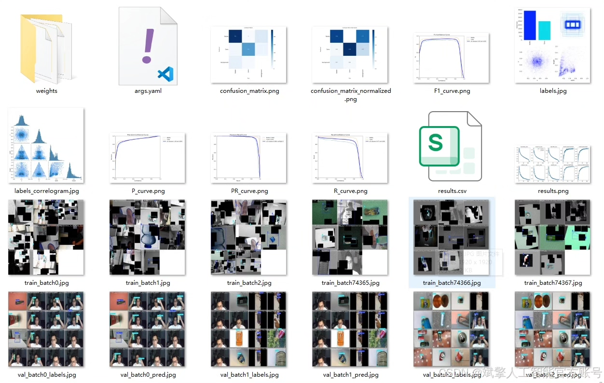
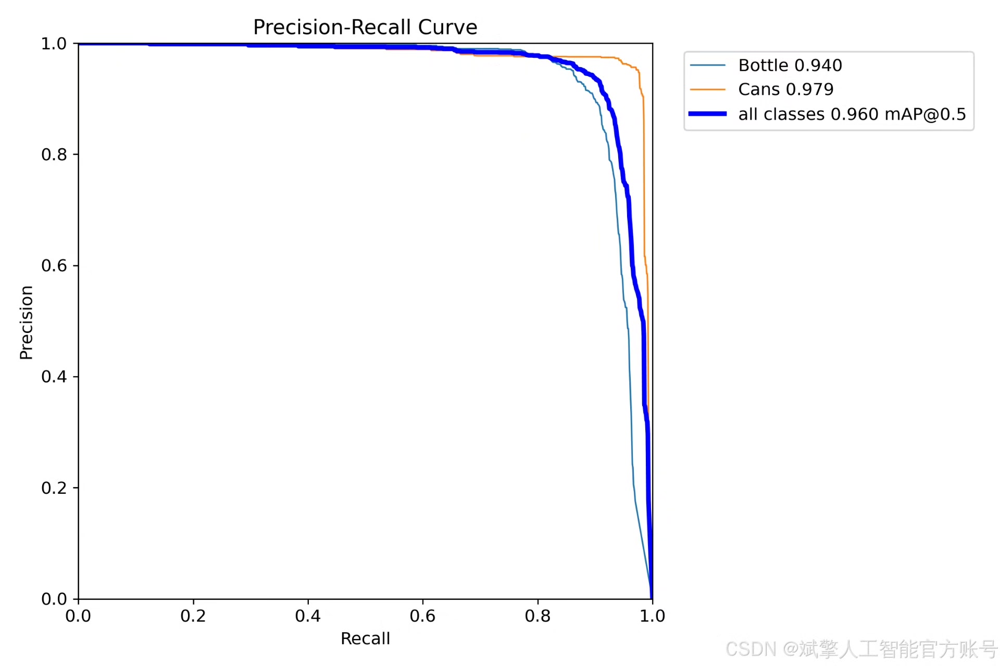
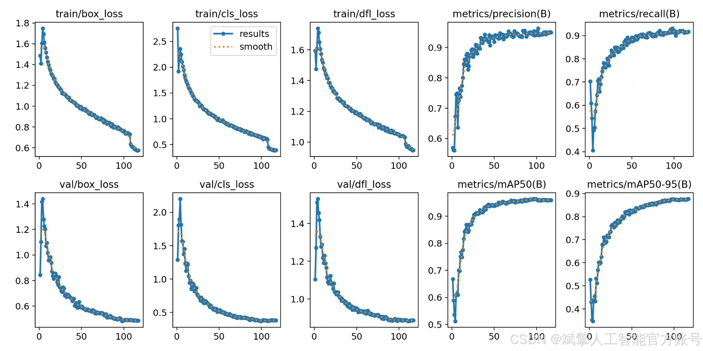
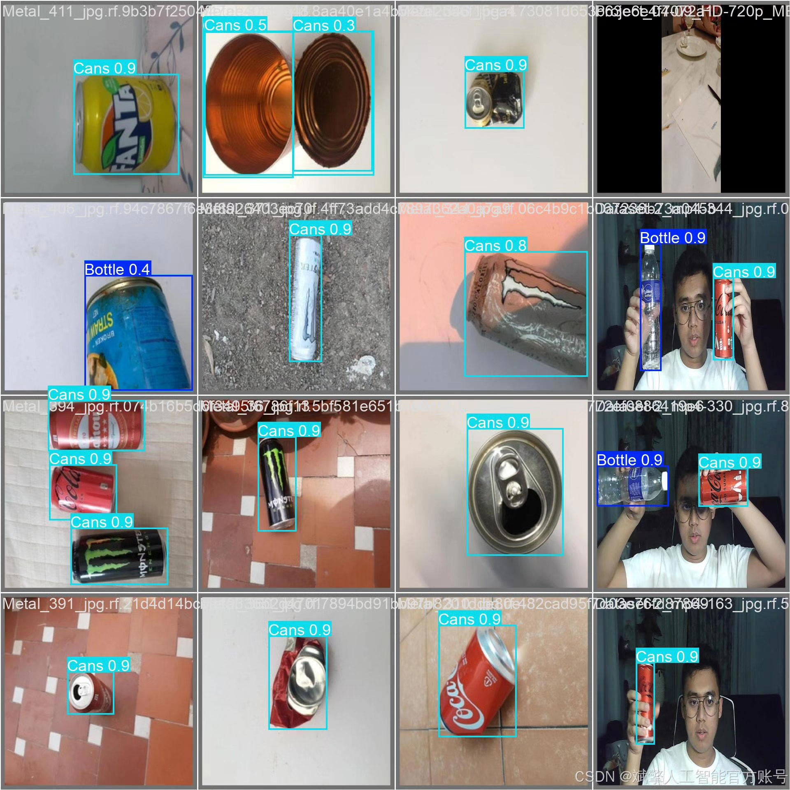

# YOLOv11 waste recognition system

## Body

YOLOv11 Waste Identification System Based on Deep Learning YOLOv11's Solid Waste Identification and Detection System (YOLOv11+YOLO dataset + UI interface + login registration interface + Python project source code + model)

This study is based on the advanced YOLOv11 object detection algorithm, developing a set of efficient and accurate intelligent waste identification and detection system. The system is specifically optimized for two key targets in recyclables—"Bottle" and "Cans", aiming to provide core technical support for intelligent waste sorting, automated recycling sorting, and other environmental applications. By utilizing deep learning technology, the system can process images or video streams in real-time, quickly locate and precisely classify waste targets in the field of vision, significantly improving the efficiency and automation level of waste sorting, which is of great significance for promoting the resource utilization of urban solid waste.

Dataset:
nc: 2
names: ['Bottle', 'Cans'],
dataset quantity: training set 5553, validation set 1474, test set 940

✅ User login registration: Support password detection and security verification.
✅ Three detection modes: Based on YOLOv11 model, support image, video, and real-time camera three detection, accurately identify targets.
✅ Dual screen comparison: Display original scene and detection results on the same screen.
✅ Data visualization: Real-time table displaying the category, confidence, and coordinates of detected targets.
✅ Intelligent parameter adjustment: Provide confidence sliders, dynamically optimize detection accuracy, adapt to different scene needs.
✅ Sci-fi style interactive interface: Dark theme combined with dynamic light effects, reduce visual fatigue, improve operation experience.

## Images

## Payment

Here is a pay link on Stripe ( https://buy.stripe.com/3cs8yP7sY87d0vu9AB ). Please contact me lonlonago@foxmail.com after funding $89, and I will send you a complete data files , thank you!

